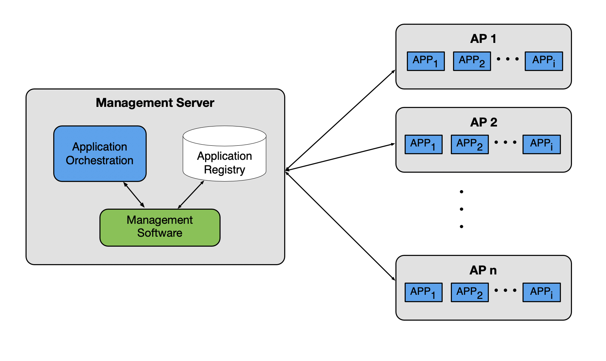
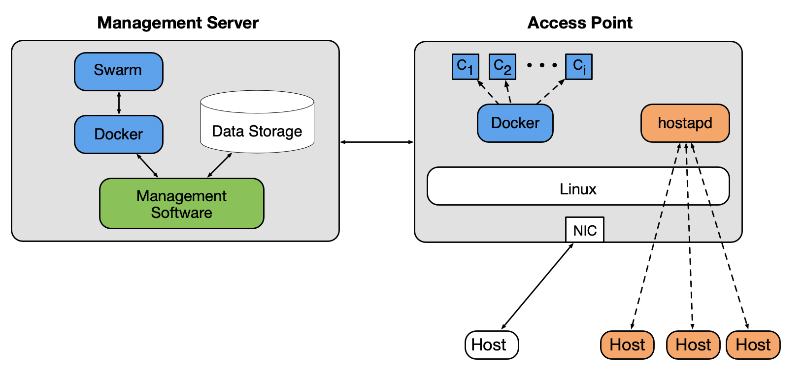

# EdgeAP: Enabling Edge Computing on Wireless Access Points

## Overview

This repository contains a proof-of-concept implementation for running applications on a wireless access point.
The main idea, as seen below, is that a management server(s) is responsible for managing applications running on a group of access points.

The diagram below is specific to our proof-of-concept implementation and the technologies used.

For information on running the management server, see `manager` for more details.\
For information on running an example application on the platform, see `example_app` for more details.